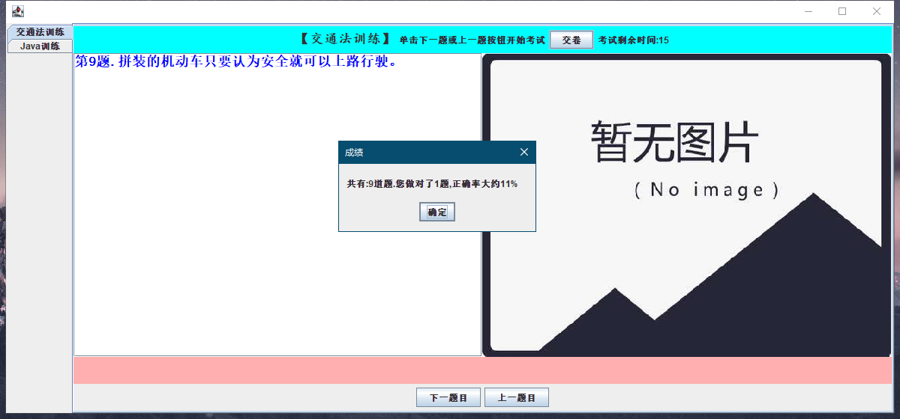

# 测试文档：

## 测试步骤

## **一、代码测试**
  
按照源文件中的包语句相关的Java源文件保存到以下目录中：

**一次编译全部源文件：**

D:\ >javac/ch5/data/*.java

将AppTest.java源文件按照包名保存到以下目录中：

D:\ch1\test

编译源文件：D:\javac ch1/test/AppTest.java

**运行AppTest类，运行结果如图所示【图片名：测试图片】**

  
  
### **2、完成所有功能版本的app测试：**

#### 1）测试步骤：

**打开命令窗口，输入：java -jar jarcs.jar**

得到如下图：【图片名：测试操作】

  

回车得到app视图如图所示：【图片名：App视图】

#### 2）游戏功能测试：

游戏功能如图所示【图片名：游戏功能】基本游戏功能实现。

