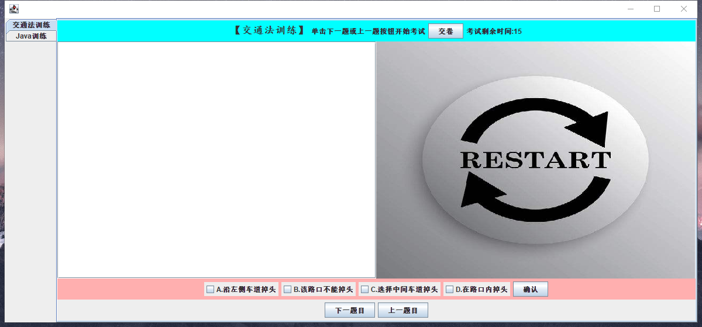

# 测试文档：

## 测试步骤

## **一、代码测试**
  
按照源文件中的包语句相关的Java源文件保存到以下目录中：

**一次编译全部源文件：**

D:\ >javac/ch5/data/*.java

将AppTest.java源文件按照包名保存到以下目录中：

D:\ch1\test

编译源文件：D:\javac ch1/test/AppTest.java

**运行AppTest类，运行结果如图所示【图片名：测试图片】**

  
  
### 按照源文件中的包语句将相关的java源文件保存到以下目录中；
D:\ch5\data  
### 编译各个源文件；  
D:\>java ch5/data/problem.java
D:\>javac ch5/data/*.java  

### 编译测试文件；

D：\>javac ch5/test/apptest.java
